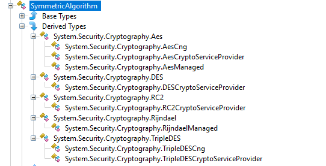
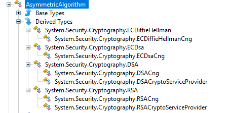
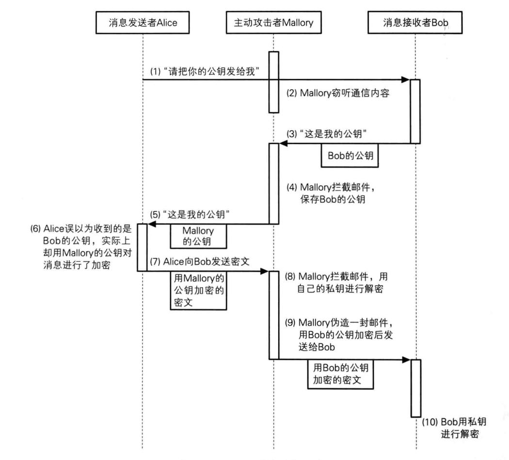
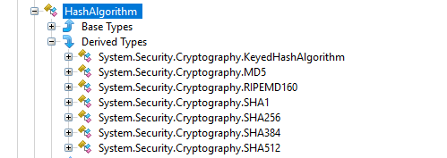
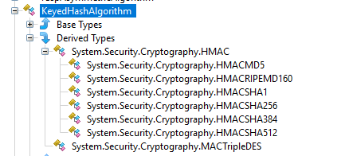
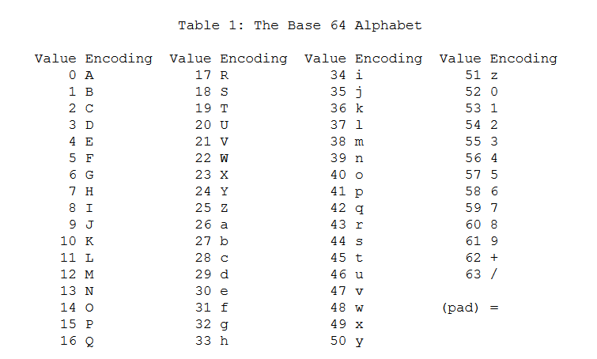

# 0 何谓信息安全？

对于信息安全性的重要性，我想大家都不会否认。那么具体来说应该具有哪些特性才能称之为安全呢？举个简单的例子：我给你发送一条消息"借给我100元"，当你收到这条消息并且处理后你的账户里面会少出来100块，我的账户会多出来100块。在这个过程中，你是消息接收方，我是消息发送方。

1. 作为通信双方的你我都不希望让其他人能读懂这条消息。这是信息的**机密性**：**即消息在传递过程中不被其他人解读。**
2. 作为通信双方的你我都不希望消息内容变成"借老子1000块！"（操，借钱还这么牛逼，100块都不给你，还要1000块！死去...）。这是信息的**完整性**：**即可以校验出信息在传送过程中是否被篡改。**
3. 作为消息接收方的你需要确认是不是真正的我给你发的借钱的消息吧，会不会是个诈骗犯要骗我100块！这是对信息的**认证**：**即接收者要可以验证消息的发送者确实是自己希望的发送者。**
4. 作为消息接收方的你肯定不希望在借给了我100块之后，我耍无赖失口否认说没借过你钱，这是信息的**不可否认性**：**即消息发送者不可以否认说这个信息不是我发送的。**

总结来说，在通信过程中，满足这4个特征：**机密性**，**完整性，认证，不可否认性**，就可以认为信息是安全的。那么接下来的几个小节来介绍一下有那些工具可以使得我们在传递消息的时候具有以上4个特征。

# 1 对称密码-对称密钥（Symmetric Cryptography）

**对称密码加密可以保障信息的机密性**。举一个简单的例子，一把锁，两把相同的钥匙，就是对称密码；即：使用相同的密钥来加密和解密。没有密钥的其他人是无法解读信息的真正内容是什么的。常见的两个对称加密标准有DES和AES。

DES是一种对称密钥加密算法，在1976年被美国联邦政府的国家标准局确定为联邦资料处理标准，随后在国际上广泛流传开来。它基于使用56位密钥的对称算法。现在现在已经不是一种安全的加密方法，主要因为它使用的56位密钥过短。后来又发展出了3DES（即执行三次DES加密）。由于DES已经不再安全，后来又推出了新的对称加密标准AES，采用的算法为Rijndael。**算法的具体实现逻辑这里不去解释，这里关注的是如何利用它们（即，保障信息的机密性的手段）**。看一下简单的加密解密的数学公式：

1.  加密：`encrypted_data = encrypt_function(message, key)`；
2.  解密：`message = decrypt_function(encrypted_data, key)`；

C#使用AES的代码如下：

```csharp
/// <summary>
///  AES加密
/// </summary>
/// <param name="key">128bit,192bit,125bit</param>
/// <returns></returns>
public static byte[] AESEncrypt(this byte[] value, byte[] key)
{
    //todo 参数检查
    using (var symmetricAlgorithm = Aes.Create())
    {
        symmetricAlgorithm.Key = key;
        symmetricAlgorithm.Mode = CipherMode.ECB;
        symmetricAlgorithm.Padding = PaddingMode.PKCS7;
        //加密
        using (var encryptor = symmetricAlgorithm.CreateEncryptor())
        {
            return encryptor.TransformFinalBlock(value, 0, value.Length);
        }
    }
}

/// <summary>
///  AES解密
/// </summary>
/// <param name="key">128bit,192bit,125bit</param>
/// <returns></returns>
public static byte[] AESDecrypt(this byte[] value, byte[] key)
{
    //todo 参数检查
    using (var symmetricAlgorithm = Aes.Create())
    {
        symmetricAlgorithm.Key = key;
        symmetricAlgorithm.Mode = CipherMode.ECB;
        symmetricAlgorithm.Padding = PaddingMode.PKCS7;
        //解密
        using (var encryptor = symmetricAlgorithm.CreateDecryptor())
        {
            return encryptor.TransformFinalBlock(value, 0, value.Length);
        }
    }
}

static void Main()
{
    var value = "lnh".ToBytes(Encoding.UTF8);
    //构造128bit的key，guid正好是128，权且当作key了。
    var key = Guid.NewGuid().ToByteArray();
    var encryptedData = value.AESEncrypt(key);
    var decryptedData = encryptedData.AESDecrypt(key);
    var decryptedDataString = Encoding.UTF8.GetString(decryptedData);
    Console.WriteLine();
}
```

.Net库已经封装好了一些对称加密的类，开箱即用：



## 1.1 遗留问题

**密钥配送问题**：共享的密钥如何交到接受消息方的手上呢？双方可以事先共同约定一个密钥，但是这种办法是无法满足互联网规模的需要的，互联网规模的环境是假设通信双方事先并不知道对方的存在，怎么事先约定呢，行不通吧。

下面接下来的公钥密钥可以解决这个问题。

# 2 公钥密码-非对称密钥（Asymmetric Cryptography）

对称密码加密可以解决信息的机密性的问题，但是却无法提供双方如何才能得到加密所用密钥的途径。我们回到最初的目的想一想，我们想要的机密性的核心在于别人无法取得信息的真实内容，也就是解密；而如何生成这个机密的信息，其实并不是我们关注的点，你能生成，他能生成，都没区别，只要我控制住只有我才能解密，那么机密性的问题就解决了。所以解决密钥配送的问题的关键就在于，把密钥分成两部分，一个加密用，一个解密用，它们总是成对出现的。配送的是加密用的密钥（也叫公钥），解密用的叫私钥，这个只有我自己知道，不会在任何地方传输，那么也就不存在配送的问题了。

其实很多计算机中的问题都是无解的，往往却又是有解决办法的，它的解决办法其实并不是直接的解决这个问题，而是规避掉这个问题，使得它不在是一个问题的。比如密钥配送的问题，如果说我们有安全的方式解决密钥配送的问题，直接使用这个安全的方式配送我们想要传递的信息不就是了，我们还绕个弯配送密钥干什么呢。公钥密码其实并未解决密钥配送的问题，而是使得它不再是个问题，即：公钥可以公开给任何人，不再需要保密（本质上来说，密钥和待加密的信息同样重要），而是通过控制解密来达到我们想要的机密性，绕过了如何机密的配送密钥的问题。

**公钥密码就是这么一个简单的原理：公钥（=`public_key`）加密，私钥（=`private_key`）解密，它可以保障信息的机密性，同时解决密钥的配送问题**。那么这个时候通信双方的流程就是这样的：

1.  发送方向接收方请求一个 `public_key` ；
2.  发送方使用 `public_key` 加密消息，`public_key` 和加密的消息泄露都没关系，因为只有 `private_key` 才能解密；
3.  接收方用 `private_key` 解密消息。

至于如何产生出来这样一对 `public_key` 和 `private_key` 以及相对于的加密解密算法，这其中涉及到很复杂的数学问题，这里就不展开介绍了（笔者也不懂...）。我们看一下最广泛使用的公钥密码算法RSA在C#里面怎么使用吧：

```csharp
/// <summary>
///  RSA加密
/// </summary>
/// <param name="publicKey">公钥</param>
/// <returns></returns>
public static byte[] RSAEncrypt(this byte[] value, string publicKey)
{
    //todo 参数检查
    using (var asymmetricAlgorithm = new RSACryptoServiceProvider())
    {
        asymmetricAlgorithm.FromXmlString(publicKey);
        return asymmetricAlgorithm.Encrypt(value,false);
    }
}

/// <summary>
///  RSA解密
/// </summary>
/// <param name="privateKey">私钥</param>
/// <returns></returns>
public static byte[] RSADecrypt(this byte[] value, string privateKey)
{
    //todo 参数检查
    using (var asymmetricAlgorithm = new RSACryptoServiceProvider())
    {
        asymmetricAlgorithm.FromXmlString(privateKey);
        return asymmetricAlgorithm.Decrypt(value,false);
    }
}

static void Main()
{
    string privateKey;
    string publicKey;
    using (var asymmetricAlgorithm = RSA.Create())
    {
        privateKey = asymmetricAlgorithm.ToXmlString(true);
        publicKey = asymmetricAlgorithm.ToXmlString(false);
    }

    var value = "lnh".ToBytes(Encoding.UTF8);
    //公钥加密
    var encryptedData = value.RSAEncrypt(publicKey);
    //私钥解密
    var decryptedData = encryptedData.RSADecrypt(privateKey);

    var decryptedDataString = Encoding.UTF8.GetString(decryptedData);
    Console.WriteLine();
}
```

.Net库中已经提供了公钥密码相关的类，开箱即用：



## 2.1 对公钥密钥的攻击

中间人攻击：这钟类型的攻击发生在上述流程中的第一步，即发送方A向接收方B请求 `public_key` 的时候。这时有一个拦路打劫的家伙M，截获了这个 `public_key` ，自己据为己有。然后M把自己的一个 `public_key` 给到了A，A是浑然不觉，傻乎乎的用这个假的 `public_key` 加密了信息，发送了出去，这时候M拦截到了这个消息，用自己的 `private_key` 解密了这个消息，然后篡改一番，用真正的 `public_key` 进行加密，发给了B。这个时候B以为是A发送的，A也以为自己发给了B，其实都被M给玩了...文字可能不是很清晰，看图：



## 2.2 遗留问题

**公钥的认证问题**：公钥密钥可以解决规避掉的配送问题，但是新问题又来了，这个公钥真的是你的吗？针对上述的中间人攻击，其实我们发现，获取公钥的这一方并不能确认自己收到的公钥就是自己真正请求的那一方提供的。这个问题先放一放（后续会介绍），下面先看看保障信息的完整性方面有那些工具可用。

# 3 密码散列函数（Cryptographic hash function）

**密码散列函数可以保障的信息完整性，用来校验要传递的信息是否被篡改过**。比如通常在下载文件的时候，官方的网站上都会列出来其MD5或者SHA1的值来校验。它的工作原理和要求大致如下：

1.  输入一组数据message，然后得到一组简短的数据hash，只要是采用相同的算法，输入message就能得到hash：`hash = hash_function (message)`；
2.  其过程是不可逆的，你不能由hash得出message；
3.  满足message的微小变化会（比如只改动1字节）会使得hash产生巨大的变化（就好比两个双胞胎，各处都很像，但是他们的指纹却不是相同的）；
4.  两组不同的消息message1和message2，不能得出相同的hash（理论上可以，只是要尽可能的使这个过程困难）。

常用的密码散列函数（算法）有Message Digest Algorithm以及Secure Hash Algorithm。

## 3.1 MD5（Message Digest Algorithm 5）

中文明为消息摘要算法第五版，这也说明其实它也有前面几个版本，比如MD4（这里就不介绍了）。MD5算法是输入任意长度的数据（Message），然后算出固定长度的数据 `16byte = 128bits` ，用16进制表示这16个byte就是32位。C#使用MD5的代码如下：

```csharp
/// <summary>
/// MD5摘要算法
/// </summary>
/// <param name="value"></param>
/// <returns>128 bits,16 byte array</returns>
public static byte[] ToMD5(this byte[] value)
{
    if (value == null || value.Length == 0)
    {
        throw new ArgumentNullException(nameof(value));
    }
    using (var hashAlgorithm = MD5.Create())
    {
        return hashAlgorithm.ComputeHash(value);
    }
}
```

再一次指出，md5的结果是固定的 `16byte = 128bits` ，用16进制表示是32个字符。网上由很多的16进制16个字符的md5，其实这都不是完整的md5，只是截取了32位中的16位而已。

## 3.2 SHA ( Secure Hash Algorithm )

从使用者的角度来看，MD5和SHA没有什么本质区别，差异在于其算法的实现方式，生成的hash的长度，其抗攻击破解的难度不一样。此外由于SHA的强度比MD5要大，所以在计算SHA的时候，所消耗的资源（时间，空间都有）也会比MD5要多。即使如此，现在MD5（128bit）和SHA-1（160bit）均已遭到了破解：[https://news.cnblogs.com/n/563589/](https://news.cnblogs.com/n/563589/)。SHA家族现有的以下成员如下有SHA-1（160）、SHA-2（SHA-224,SHA-256,SHA-384,SHA-512）和SHA-3（SHA3-224，SHA3-256，SHA3-384，SHA3-512）。C#中使用SHA256的代码如下：

```csharp
/// <summary>
/// SHA256哈希算法
/// </summary>
/// <returns>256 bits,32 byte array</returns>
public static byte[] ToSHA256(this byte[] value)
{
    if (value == null || value.Length == 0)
    {
        throw new ArgumentNullException(nameof(value));
    }
    using (var hashAlgorithm = SHA256.Create())
    {
        return hashAlgorithm.ComputeHash(value);
    }
}
```

.NET的库已经帮我们封装好了密码散列函数相关的类，开箱即用。



## 3.3 密码散列函数的实际应用

1. 检查文件是否被修改：上面一开始举得例子下载文件的例子。
2. 基于口令的加密：通常我们在存储用户的密码的时候，都会采用这种方式（除非你是csdn），一般还会辅助的加上盐。
3. 消息认证码：后面介绍到到。
4. 数字签名：后面会介绍到。
5. 伪随机数生成器：后面会介绍到。

## 3.4 针对密码散列函数的攻击

1.  强碰撞性攻击：比如上面提到的Google破解了SHA-1，即使用大量的计算来找出两个数据message不一样，但是hash值却一样的过程，如果找到了这样的两块数据，那么再使用这个hash作为数据的完整性校验的手段，其实已经没有意义了。解决办法是升级SHA-2，增大计算出这样两块数据的难度。
2.  暴力破解：比如网上很多的MD5的解密，其实原理在于他们有大量的MD5 hash库，比如 `123456` 的MD5是 `e10adc3949ba59abbe56e057f20f883e` ，那么在你给我一个 `e10adc3949ba59abbe56e057f20f883e` 的时候，我就知道你的原文是 `123456` 。解决办法是加盐，增大这种暴力比对的难度。

针对上面两种攻击方式都是在于增加破解难度，使其在现有的计算能力下不能轻易的被攻破，没有绝对的安全，只是相对上来说是安全的，当破解你带来的收益要低于其破解成本的时候，你才是安全的。

## 3.5 遗留问题

**hash被篡改了**：比如上面下载文件的时候官方会给出MD5或者SHA1的hash值，这里我们假设一下，官方提供hash值的渠道被黑掉了，给了你一个篡改过的hash值，然后你下载了一个被篡改过的文件，你是分辨不出来的。其实我们下载文件，然后比对官方给的hash值，这里是假设官方的hash值是没有被篡改的。

那么接下来的消息认证码MAC是可以解决这个问题。

# 4 消息认证码（Message Authentication Code）

**消息认证码（MAC）的作用就是在保障完整性的基础上，同时提供认证（_认证=消息是来自真正的发送者_）的功能，用来解决上述密码散列函数遗留的问题**。可以简单的这样理解，MAC是在密码散列函数+共享密钥后算出的hash值，由于密钥是只有通信双方才知道的，那么就可以认为通过MAC得到的hash可以保障信息的完整性以及同时提供认证的能力。这里我们假设双方不存在密钥配送的问题（即双方已经持有相同的密钥，至于是通过什么方式传递的，这里先不关心）。

使用密码散列函数可以实现MAC，这种方式称为HMAC（Hash Message Authentication Code）：[https://tools.ietf.org/html/rfc2104](https://tools.ietf.org/html/rfc2104) 和 [https://en.wikipedia.org/wiki/Hash-based_message_authentication_code](https://en.wikipedia.org/wiki/Hash-based_message_authentication_code)。计算公式可以简单的理解为：`mac = mac_function (message,key)`。C#中使用HMAC的代码如下：

```csharp
/// <summary>
/// HMACSHA1算法
/// </summary>
/// <returns>160 bits,20 byte array</returns>
public static byte[] ToHMACSHA1(this byte[] value,byte[] key)
{
    if (value == null || value.Length == 0)
    {
        throw new ArgumentNullException(nameof(value));
    }
    if (key == null || key.Length == 0)
    {
        throw new ArgumentNullException(nameof(key));
    }
    using (var macAlgorithm =new HMACSHA1())
    {
        macAlgorithm.Key = key;
        return macAlgorithm.ComputeHash(value);
    }
}

static void Main()
{
    var value = "lnh".ToBytes();
    var key = "123".ToBytes();
    var mac = value.ToHMACSHA1(key);
    Console.WriteLine();
}
```

.Net类库中开箱即用的MAC相关的类，开箱即用：



## 4.1 消息认证码的实际应用

1. SWIFT：此SWIFT非苹果的Swift语言，而是Society for Worldwide Interbank Financial（环球银行金融电信协会）的简写。在银行之间进行传递交易消息时，会用到MAC来确认消息的完整性以及对消息进行认证。在没有使用公钥密码进行密钥交换之前，消息认证码使用的共享密钥时靠人力通过11路来完成的。
2. IPsec：增强版Ip协议，用来认证和校验消息的完整性。
3. SSL/TLS：后续会介绍到。

## 4.2 针对消息认证码的攻击

1. 重放攻击：比如你给我转账100元，携带了mac的消息，其实我并不用破解你的消息和mac,原封不动拿你的消息重复给我转账就是了，你信不信我可以把你账户里面所有的钱都变成我的...解决办法是对消息添加编号和时间戳，使得消息接收方针对这个消息只处理一次。
2. 密钥推测攻击：和密码散列码的暴力攻击是类似的，不再细说。

## 4.3 遗留问题

**消息不是我发送的，是你自己伪造的**：基于MAC的原理是在于通信双方共享密钥，那么消息接收方可以判断消息是来自真正的发送者，但是却无法向第三者证明这一点，为什么呢？因为消息的接收方也有密钥啊，消息发送者完全可以说这是消息接收者自己用这个共享密钥生成的消息，毕竟密钥双方都有。

那么接下来的数字签名是可以解决这个问题。

# 5 数字签名（Digital Signature）

上面的MAC可以保障信息的完整性，同时具有提供消息认证的能力，但是又遗留了一个可以否认消息是我发送的问题。究其原因在于通信双方使用了同一个密钥来生成MAC，你说是他生成的，他说是你生成的。那么怎么解决呢，其实也简单，双方使用不同的密钥；消息发送方使用签名密钥生成一个"签名"（就像签字画押按手印一样的道理，表示我承认这些信息是我发送的），消息接收方使用另外验证密钥来验证这个签名，这其实就是**数字签名**。

**数字签名对签名密钥和验证密钥进行了区分，验证密钥无法生成签名；此外签名密钥只能由签名人持有，而验证密钥则可以由任何想要验证签名的人持有**。回想一下，这个签名密钥和验证密钥是不是感觉似曾相识，对了，和上面我们提到的公钥密码中的公钥和私钥非常类似吧。

> **公钥密码：密钥分为加密密钥和解密密钥，用加密密钥无法进行解密；解密密钥只有需要解密的人持有，而加密密钥则是任何需要加密的人都可以持有。**

**实际上，数字签名和公钥密钥有着非常紧密的联系，简单点来说，数字签名是通过把公钥密码 _反过来用_ 来实现的**：

|            | 私钥 / 签名密钥      | 公钥 / 验证密钥            |
| ---------- | -------------------- | -------------------------- |
| 公钥密码   | 接收者解密时使用     | 发送者加密时使用           |
| 数字签名   | 签名者生成签名时使用 | 验证者验证签名时使用       |
| 谁持有密钥 | 个人持有             | 只要需要，任何人都可以持有 |

数字签名的实现是：**签名人用私钥加密{一段信息}来生成签名，验证者使用公钥来解密这个签名，如果可以解密成功，则说明验证成功**。觉得很奇怪是不是？为什么能用公钥解密就证明签名验证通过了呢？其实这是由于私钥和密钥是成对出现的（具有严密的数学关系），只有公钥才能解密与之配对的私钥加密的信息，那么既然能够解密，那么这个消息肯定是持有私钥的这一方生成的。你估计还会想到一个问题，公钥是公开的呀，你有我由他也有，那么私钥生成的这个加密的签名大家都可以解密，根本没有机密性啊。是的，这样理解是完全正确的，私钥加密的信息是不具备机密性的；这是因为**数字签名是用来提供消息的不可否认性的，它并不关心机密性的问题**。

上面我们说到**签名人用私钥加密{一段信息}来生成签名**。那么问题来了，这 `{一段信息}` 是什么信息？关于这一段信息我们由两种选择：1是消息本身，2是消息的hash。

下图是对消息本身进行签名的过程：


下图是对消息的hash进行签名的过程：


实际中我们一般采用的是对消息的hash进行签名的方式，因为消息本身可能非常大，加密解密过程会非常消耗资源。再C#中使用RSA来实现数字签名：

```csharp
/// <summary>
/// 数字签名
/// </summary>
/// <returns></returns>
public static byte[] DigitalSignature(this byte[] value, string privateKey)
{
    using (var asymmetricAlgorithm = new RSACryptoServiceProvider())
    {
        asymmetricAlgorithm.FromXmlString(privateKey);
        return asymmetricAlgorithm.SignData(value, SHA1.Create());
    }
}

/// <summary>
/// 数字签名验证
/// </summary>
/// <returns></returns>
public static bool DigitalSignatureVerify(this byte[] value, string publicKey,byte[] digitalSignature)
{
    using (var asymmetricAlgorithm = new RSACryptoServiceProvider())
    {
        asymmetricAlgorithm.FromXmlString(publicKey);
        return asymmetricAlgorithm.VerifyData(value, SHA1.Create(), digitalSignature);
    }
}

static void Main()
{
    string privateKey;
    string publicKey;
    using (var asymmetricAlgorithm = RSA.Create())
    {
        privateKey = asymmetricAlgorithm.ToXmlString(true);
        publicKey = asymmetricAlgorithm.ToXmlString(false);
    }

    var value = "lnh".ToBytes(Encoding.UTF8);

    //用私钥生成数字签名
    var digitalSignature = value.DigitalSignature(privateKey);

    //用公钥验证数字签名
    var verified = value.DigitalSignatureVerify(publicKey, digitalSignature);

    Console.WriteLine();
}
```

数字签名本身的实现是使用了公钥密钥相关的算法。

## 6.1 数字签名的实际应用

1.  公钥证书：上面在介绍公钥密码的时候，遗留的一个公钥认证的问题，即我们怎么才能知道自己拿到的公钥是不是真正的公钥，而不是被第三方伪造的呢？可以把公钥当作消息，然后施加数字签名，所得到的就是公钥证书，关于证书的知识后续博客会介绍。
2.  SSL/TLS：SSL/TLS在认证服务器是否合法的时候会使用服务器证书，就是上面提到的公钥证书；于此相对，服务器在对客户端进行认证的时候，也会使用客户端证书。关于SSL/TLS后续博客会介绍。

## 6.2 针对数字签名的攻击

1.  中间人攻击：在[公钥密码这一小节中提到了中间人攻击](#2-公钥密码-非对称密钥asymmetric-cryptography)，因为数字签名其实就是使用它来实现的，那么对于数字签名来说，中间人攻击也是具有相同的威胁。
2.  对密码散列函数的攻击：数字签名使用了密码散列函数，那么数字签名也面临同样的威胁。
3.  利用数字签名攻击公钥密钥：这块好复杂，笔者研究明白再补充( ╯□╰ )。。。

## 6.3 遗留问题

数字签名可以识别出篡改和伪装，还可以防止否认，也就是说数字签名可以提供信息安全中的**完整性**、**认证**和**不可否认性**这3点的保障（很强大有木有）。然而这一切都基于一个假设**公钥必须是真正的发送者提供的**，和公钥密钥陷入了同一个问题。**我们发现自己陷入了一个死循环：数字签名可以用来识别篡改、伪装以及否认的，但是为此我们又需要从一个没有被伪装的真正的发送者那里得到一个没有被篡改的密钥......**这是一个鸡生蛋蛋生鸡的问题。


细心的读者或许可以看出来，上面我们的加密、散列、mac，签名也好，消费的数据都是`byte[]`，而`byte[]`是不方便书写、打印、复制和粘贴的，下面看一看`byte[]`编码的问题。换换脑子，鸡生蛋还是蛋生鸡的问题放一放先。

# 7. 编码（Encoding）

我们知道计算机的任何数据底层都是由0和1这样的二进制表示的，不管你是文本，图片，音频或者视频还是exe等等，都是01这样的二进制。比如我们上面列举的各种算法，其实它们都是以`1byte = 8bit`作为输入的，输出也是如此。很多场景下，传输的数据被限制在**ASCII码表**（[https://tools.ietf.org/html/rfc20](https://tools.ietf.org/html/rfc20)）以内，比如url中的字符是ASCII中很小的一部分。在[https://tools.ietf.org/html/rfc4648](https://tools.ietf.org/html/rfc4648)中定义了base16，base32，base64这几种编码方式，最常用的方式由16进制（也叫base16）和base64编码。

## 7.1 16进制（base16）

16进制的核心在于把一个`1byte = 8bit`分割成**两组4个bit**。那么这四个bit组合起来最小的数字是**0（2⁰）**，最大是**16（2⁴）**。编码后每一组（4个bit）都转成十进制，对应一个字母（使用1个byte表示），也就是相当于对原始的数据放大了2倍，其字母表如下：


举个简单的例子如下，比如**李**这个原始字符，我把它先用UTF8取得byte数组，然后把byte数组转成16进制：

```csharp
public static string ToHexString(this byte[] value)
{
    return BitConverter.ToString(value).Replace("-","");
}

public static byte[] ToBytes(this string value, Encoding encoding = null)
{
    if (value==null)
    {
        throw new ArgumentNullException(nameof(value));
    }
    if (encoding==null)
    {
        encoding = Encoding.UTF8;
    }
    return encoding.GetBytes(value);
}

static void Main()
{
    var hex = "李".ToBytes().ToHexString();
    //hex=E69D8E
    Console.WriteLine(hex);
}
```

具体的编码流程：

<table>
<tbody>
<tr>
<td>原始数据</td>
<td colspan="24">李</td>
</tr>
<tr>
<td>(1).转成byte数组（UTF8）</td>
<td colspan="8">230</td>
<td colspan="8">157</td>
<td colspan="8">142</td>
</tr>
<tr>
<td>(2).二进制形式</td>
<td>1</td>
<td>1</td>
<td>1</td>
<td>0</td>
<td>0</td>
<td>1</td>
<td>1</td>
<td>0</td>
<td>1</td>
<td>0</td>
<td>0</td>
<td>1</td>
<td>1</td>
<td>1</td>
<td>0</td>
<td>1</td>
<td>1</td>
<td>0</td>
<td>0</td>
<td>0</td>
<td>1</td>
<td>1</td>
<td>1</td>
<td>0</td>
</tr>
<tr>
<td>(3).按照4bit一组分割</td>
<td colspan="4">1110</td>
<td colspan="4">0110</td>
<td colspan="4">1001</td>
<td colspan="4">1101</td>
<td colspan="4">1000</td>
<td colspan="4">1110</td>
</tr>
<tr>
<td>(4).对应的10进制数值</td>
<td colspan="4">14</td>
<td colspan="4">6</td>
<td colspan="4">9</td>
<td colspan="4">13</td>
<td colspan="4">8</td>
<td colspan="4">14</td>
</tr>
<tr>
<td>(5).对应的16进制字母</td>
<td colspan="4">E</td>
<td colspan="4">6</td>
<td colspan="4">9</td>
<td colspan="4">D</td>
<td colspan="4">8</td>
<td colspan="4">E</td>
</tr>
<tr>
<td>(6).16进制编码</td>
<td colspan="24">E69D8E</td>
</tr>
</tbody>
</table>

其中核心步骤在(2)-(5)，下面详细解释以下：

1. (1)把原始数据转成byte数组，我这里用的是UTF8编码，转成了3个byte（如果你用GB2312，"李"这个字符对应的就不是这三个byte了，而是另外的两个byte：`192 238`）；如果你的数据原本就一个音频文件或者其他二进制文件，那么你得到的就直接是一个byte的数组。这一步的目的在于准备数据。还并未进入到16进制编码的环节。
2.  (2)把第一步得到的byte数组以二进制形式展开。
3.  (3)依次把(2)按照4个bit为一组进行分割。
4.  (4)把(3)的每一组都转成10进制的数值。
5.  (5)根据(4)得到的数值查找16进制的编码表，得到对应的字母。
6.  (6)把(5)中得到的字母依次组合在一起，就是最终的结果。

## 7.2 base64编码

base64也可以说是64进制，它是用6个bit表示一个字符，也就是**2⁶。**其实核心原理和的16进制是一模一样的，但是有点不同的是，当一组byte（8bit）拆成4bit一组的的时候，是永远都可以成对的拆分的（8÷4=2）；但是当一组byte想要拆成6bit一组的时候，可能就无法正好拆分了（8÷6=1.333333.....），只有数据的bit数是8和6的最小公约数24的整数倍的情况下，才可以正好拆分，简化点就是**byte数÷3**。不能整除的时候，这个时候就需要补上一些0凑够6位。

标准的base64的码表是由：**[A-Z]、[a-z]、[0-9]、`+`和`/`构成的（26+26+10+2=64），再附加一个对齐用的`=`（**个人理解这个`=`完全是多余，就像人的阑尾似的...**），**一共65个字符。



除了这个标准的码表之外，还有一些其他的码表，主要是因为`/+=`这三个字符再一些特殊的场景下术语特殊字符，比如在url传递的时候，这三个字符都是特殊字符，需要替换掉，比如把`/+`换成`-_`这2个字符。还拿上面的`李`举例子（这次我们用GB2312，故意使它无法整除：李字在GB2312中使用2个byte表示，不能整除3）：

```csharp
public static string ToBase64String(this byte[] value)
{
    return Convert.ToBase64String(value);
}

static void Main()
{
    var base64 = "李".ToBytes(Encoding.GetEncoding("GB2312")).ToBase64String();

    //base64 wO4=
    Console.WriteLine(base64);
}
```
具体的编码流程如下：

<table>
<tbody>
<tr>
<td>原始数据</td>
<td colspan="24">李</td>
</tr>
<tr>
<td>(1).转成byte数组（GB2312）</td>
<td colspan="8">192</td>
<td colspan="8">238</td>
<td colspan="8">&nbsp;</td>
</tr>
<tr>
<td>(2).二进制形式</td>
<td>1</td>
<td>1</td>
<td>0</td>
<td>0</td>
<td>0</td>
<td>0</td>
<td>0</td>
<td>0</td>
<td>1</td>
<td>1</td>
<td>1</td>
<td>0</td>
<td>1</td>
<td>1</td>
<td>1</td>
<td>0</td>
<td>补0</td>
<td>补0</td>
<td>&nbsp;</td>
<td>&nbsp;</td>
<td>&nbsp;</td>
<td>&nbsp;</td>
<td>&nbsp;</td>
<td>&nbsp;</td>
</tr>
<tr>
<td>(3).按照6bit一组分割</td>
<td colspan="6">110000</td>
<td colspan="6">001110</td>
<td colspan="6">111000</td>
<td colspan="6">&nbsp;</td>
</tr>
<tr>
<td>(4).对应的10进制数值</td>
<td colspan="6">48</td>
<td colspan="6">14</td>
<td colspan="6">56</td>
<td colspan="6">&nbsp;</td>
</tr>
<tr>
<td>(5).对应的base64字母</td>
<td colspan="6">w</td>
<td colspan="6">O</td>
<td colspan="6">4</td>
<td colspan="6">补=</td>
</tr>
<tr>
<td>(6).base64编码</td>
<td colspan="24">wO4=</td>
</tr>
</tbody>
</table>

这个过程就不再详细解释了，和上面的16进制是一样的，不同之处在于对齐补上`=`。

# 8 总结一下

以上简单的介绍了一下信息安全方面的一些特征，以及又哪些工具可以提供这些特征的保障（均是笔者从资料中翻出来自己解读了以下，如有错误之处，欢迎指正！）。具体每个工具只是从使用者的角度简单的介绍了一下，对实现细节并未深入研究，感兴趣的需要自己单独再去深入了解了，这篇博客主要是个入门的科普介绍而已，主要参考资料是《[图解密码技术](https://book.douban.com/subject/26822106/)》，以及维基百科的一些解释（为啥给的是英文链接?其实我发现中文的维基百科的信息比英文的少的不是一点半点的）。还有一本不错的图书《[编码 - 隐匿在计算机软硬件背后的语言](https://book.douban.com/subject/4822685/)》，个人认为是非常棒的一本计算机科学的科普读物。最后还留了一个鸡生蛋蛋生鸡的问题和公钥密码的认证问题，，，且听下回分解。

# 9 参考 & 引用

图解密码技术：https://book.douban.com/subject/26822106/

编码 - 隐匿在计算机软硬件背后的语言 ：https://book.douban.com/subject/4822685/

对称密钥 - DES：https://en.wikipedia.org/wiki/Data_Encryption_Standard

对称密钥 - AES：https://en.wikipedia.org/wiki/Advanced_Encryption_Standard

公钥密钥 - 非对称密钥 - Public-key cryptography：https://en.wikipedia.org/wiki/Public-key_cryptography

公钥密钥 - 非对称密钥 - RSA：https://en.wikipedia.org/wiki/RSA

密码散列函数：https://en.wikipedia.org/wiki/Cryptographic_hash_function

密码散列函数 - MD5：https://en.wikipedia.org/wiki/MD5

密码散列函数 - SHA-1：https://en.wikipedia.org/wiki/SHA-1

密码散列函数 - SHA-2：https://en.wikipedia.org/wiki/SHA-2

密码散列函数 - SHA-3：https://en.wikipedia.org/wiki/SHA-3

消息认证码 - HMAC: Keyed-Hashing for Message Authentication：https://tools.ietf.org/html/rfc2104

消息认证码 - Message Authentication Code：https://en.wikipedia.org/wiki/Message_authentication_code

消息认证码 - Hash-based message authentication code ：https://en.wikipedia.org/wiki/Hash-based_message_authentication_code

数字签名 - https://en.wikipedia.org/wiki/Digital_signature

编码 - ASCII format for Network Interchange：https://tools.ietf.org/html/rfc20

编码 - The Base16, Base32, and Base64 Data Encodings：https://tools.ietf.org/html/rfc4648