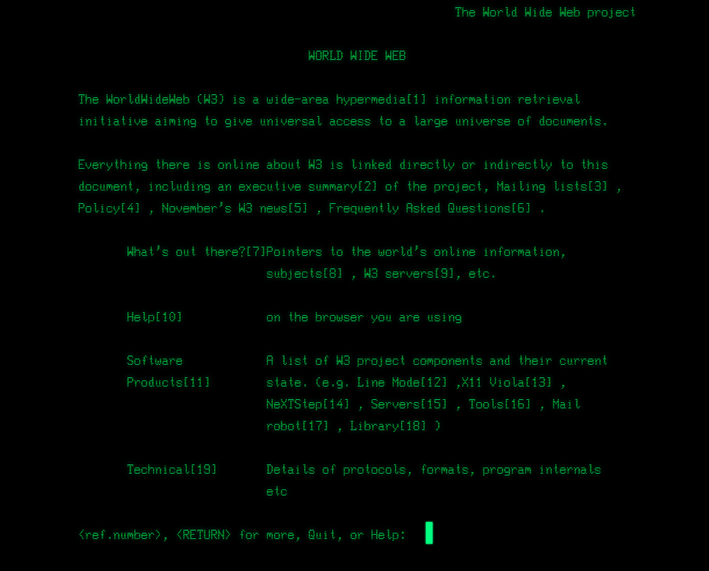

# 1 世界上第一个网站 {#1.the-first-web-site-in-the-world}

1990年12月20日，这一天对于现在的互联网来说意义非凡。欧洲核子研究组织（CREN）的科学家Tim Berners-Lee在一台NeXT电脑上启动了世界上的第一个网站（当然当时仅能Tim Berners-Lee自己访问），这台电脑至今仍保留在CREN，但当年那个网站已经不复存在了。鉴于这个网站的意义重大，CREN在2013年 **“复刻”** 了这个网站，并指向了原来的网址 : http://info.cern.ch 。由于现在的浏览器早已不是当初的样子，所以CREN还提供了一个模拟器来模拟当时浏览这个网站是什么情形。 http://line-mode.cern.ch/www/hypertext/WWW/TheProject.html 打开后如下 : 

哈哈，看起来是不是很酷炫的样子（可以通过输入数字编号进行链接的跳转）。

# 2 Hypermedia {#2.hypermedia}

我们注意看它的第一句话 : 

> The WorldWideWeb (W3) is a wide-area [hypermedia](http://info.cern.ch/hypertext/WWW/WhatIs.html) information retrieval initiative aiming to give universal access to a large universe of documents.

大意是说www是一个为了让全世界都能访问大量文档的一个的超媒体信息检索计划，其中重点在于其提到的 [hypermedia](http://info.cern.ch/hypertext/WWW/WhatIs.html) 。我们看看它怎么解释hypermedia是什么的 : 

> Hypertext is text which is not constrained to be linear.
> 
> Hypertext is text which contains [links](http://info.cern.ch/hypertext/WWW/Terms.html#link) to other texts. The term was coined by [Ted Nelson](http://info.cern.ch/hypertext/WWW/Xanadu.html#Nelson) around 1965 (see [hypertext history](http://info.cern.ch/hypertext/History.html) ).
> 
> HyperMedia is a term used for hypertext which is not constrained to be text: it can include graphics, video and [sound](http://info.cern.ch/hypertext/WWW/Talks/YesWeCan.snd) , for example. Apparently Ted Nelson was the first to use this term too.
> 
> Hypertext and HyperMedia are concepts, not products.

其中解释了什么是hyperhtext（包含link的文本内容），又指出了hypermedia是一个术语，不仅仅指代hypermeida，还可以包括一些图像，视频，声音等等。hypertext这个术语名字并不是由Tim Berners-Lee提出的，而是在更早的1965年由 [Ted Nelson](http://info.cern.ch/hypertext/WWW/Xanadu.html#Nelson) 第一次提出这个概念（ [hypertext history](http://info.cern.ch/hypertext/History.html) ）。不知道大家对于hypertext这个词是不是感觉很熟悉的样子，大名顶顶的HTML（HyperText Markup Language）就是它的一个具体实现。hypertext中的link一直是重中之重，试想如果没有这样一种机制把各种文档联系起来，那么孤零零的一些文本内容是如何也不会发展出后来的互联网的。

**hypermedia是web重中之重的一个角色，如果说没有它就没有今天的web也是不为过的。**

# 3 HTTP历史的简单回顾 {#3.http-history}

具体的HTTP协议最早是版本0.9，发布与1991年（HTTP 0.9 https://www.w3.org/Protocols/HTTP/AsImplemented.html ）。从现在的角度看可以说是一个很简陋的协议，只支持GET请求，无request header，所以只能用来展示静态文本内容，不对对于当时来说已经足够了，毕竟当初Web建立的初衷仅仅是为了在这些科学家之间共享文档信息用的。

随着Web的迅猛发展，只读的HTTP 0.9已经无法满足Web的需求了。在1996年HTTP 1.0诞生，最突出的改进在于支持POST来写数据了（基于HTML表单，HTML最初的标准诞生于1993年），使得Web终于"活动"了起来。在HTTP 1.0协议的专家组中，有一个年轻人脱颖而出，后来成为了HTTP/1.1协议专家组的负责人。这位年轻人就是Apache HTTP服务器的核心开发者 [Roy Fielding](https://en.wikipedia.org/wiki/Roy_Fielding) ，Apache软件基金会的合作创始人，也是URI协议的主要设计者，同时也参与了HTML的设计。

在1999年，Tim Berners Lee和Roy Fielding以及HTTP1.1专家组发布了HTTP 1.1版本，主要是对1.0的一些多余的设计做了一些精简和优化，比如我们现在可以在一台机器上部署多个网站，而用不同的host请求头来区分，而这个host请求头是在1.1才引入的。1.0的时候HTTP协议对网站的假设是基于一个IP对应一个网站，从来没有料到后来的一个ip会部署这么多个web站点。

HTTP 1.1从1999年至今10多年，随着越来越丰富富庞大的web，http1.1的性能问题越来越凸显出来。后来Google开发了一个SPDY协议，在TCP和HTTP之间增加了一层，重点在于提示传输性能和增加安全性，但是却强制了采用TLS。在后来制订了新版的http2，借鉴了SPDY中的一些经验，但是移除了对TLS的强制要求，至于为什么，原因很简单，这个要求违反了REST的一些架构约束（至于违反了哪些约束，后面的博客会解释）。

# 4 REST的诞生 {#4.the-birth-of-rest}

在上面我们提到一个人 : Roy Fielding，他和他的同事们在URI，HTTP1.0和HTTP/1.1协议的设计工作中，对于Web之所以取得巨大成功（同时面对早期HTTP0.9的糟糕设计），在技术架构方面的因素做了一番深入的分析和总结。Fielding将这些总结纳入到了一套理论框架之中，然后使用这套理论框架中的指导原则，用来描述解释Web的架构，以及用来指导这些协议的设计。HTTP/1.1协议的第一个草稿是在1996年1月发布的，经过了三年多时间的修订，于1999年6月成为了IETF的正式规范。用来指导HTTP协议设计的这套理论框架，最初是以备忘录的形式在专家组成员之间交流，除了IETF/W3C的专家圈子，并没有在外界广泛流传。

Fielding在完成HTTP/1.1协议的设计工作之后，回到了加州大学欧文分校继续攻读自己的博士学位。第二年（2000年）在他的博士学位论文Architectural Styles and the Design of Network-based Software Architectures中，Fielding更为系统、严谨地阐述了这套理论框架，并且使用这套理论框架推导出了一种新的架构风格，并且为这种架构风格取了一个令人轻松愉快的名字`REST-Representational State Transfer（表述性状态转移）`。**在这篇论文中，Fielding认为Web得以蓬勃发展的原因很大程度上得益于Web的架构设计满足了互联网规模的分布式超媒体系统的需要。而REST，正是Web的架构风格，现代的Web则是REST的一个架构实例。**

本篇先开个头，简单介绍一下web的历史，以及REST的诞生时机和环境。后面会逐一解释什么笔者眼中的REST是什么，欢迎有兴趣的前来讨论。

# 5 参考资料 {#5.reference}

[[理解REST] 00 参考资料][reference]

[reference]:../00-reference/