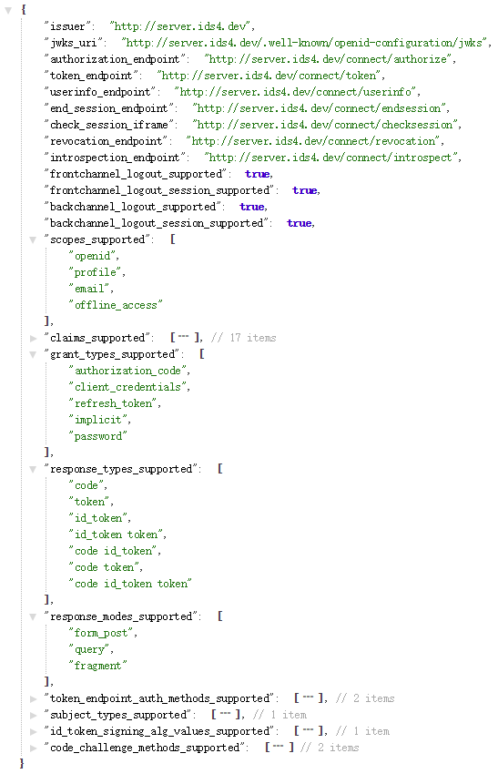
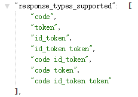
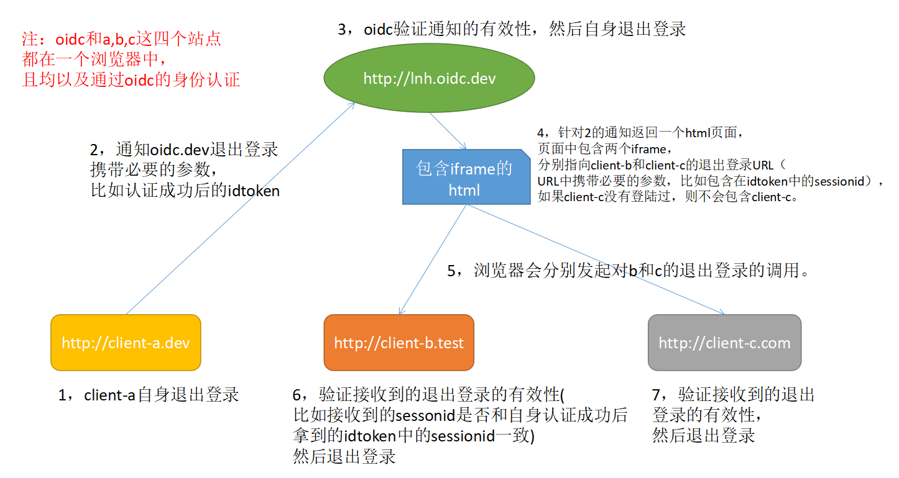

在上一篇[[认证&授权] 04 OIDC(OpenId Connect)身份认证(核心部分)][04]中解释了OIDC的核心部分的功能，即OIDC如何提供`id_token`来用于认证。由于OIDC是一个协议族，如果只是简单的只关注其核心部分其实是不足以搭建一个完整的OIDC服务的。本篇则解释下OIDC中比较常用的几个相关扩展协议，可以说是搭建OIDC服务必备的几个扩展协议(在上一篇中有提到这几个协议规范): 

1. [Discovery][OIDC-Discovery] : 可选。发现服务，使客户端可以动态的获取OIDC服务相关的元数据描述信息(比如支持那些规范，接口地址是什么等等)。
2. [OAuth 2.0 Multiple Response Types][OAuth-2-Multiple-Response-Types] : 可选。针对OAuth2的扩展，提供几个新的response_type。
3. [OAuth 2.0 Form Post Response Mode][OAuth-2-Form-Post-Response-Mode] : 可选。针对OAuth2的扩展，OAuth2回传信息给客户端是通过URL的querystring和fragment这两种方式，这个扩展标准提供了一基于form表单的形式把数据post给客户端的机制。
4. [Session Management][OIDC-Session-Management] : 可选。Session管理，用于规范OIDC服务如何管理Session信息；[Front-Channel Logout][OIDC-Front-Channel-Logout] : 可选。基于前端的注销机制。

# 1 OIDC Discovery {#1-oidc-discovery}

顾名思义，Discovery定义了一个服务发现的规范，它定义了一个api`/.well-known/openid-configuration`，这个api返回一个json数据结构，其中包含了一些OIDC中提供的服务以及其支持情况的描述信息，这样可以使得oidc服务的`RP`可以不再硬编码OIDC服务接口信息。这个api返回的**示例信息**如下(这里面只是一部分，更完整的信息在官方的规范中有详细的描述和解释说明(<http://openid.net/specs/openid-connect-discovery-1_0.html>): 


相信大家都看得懂的，它包含有授权的url，获取token的url，注销token的url，以及其对OIDC的扩展功能支持的情况等等信息，这里就不再详细解释每一项了。

# 2 OAuth2 Multiple Response Types {#2-oauth2-multiple-response-types}

在本系列的第一篇博客[[认证&授权] 01 OAuth2授权][01]中解释OAuth2的授权请求的时候，其请求参数中有一个`response_type`的参数，其允许的值有`code`和`token`两个，在这两个的基础上，OIDC增加了一个新值`id_token`(详细信息定义在<http://openid.net/specs/oauth-v2-multiple-response-types-1_0.html>) : 

1. `code` : oauth2定义的。用于获取authorization_code。
2. `token` : oauth2定义的。用户获取access_token。
3. `id_token` : OIDC定义的。用户获取id_token。

至此OIDC是支持三种类型的response_type的，不但如此，OIDC还允许了可以组合这三种类型，即在一个response_type中包含多个值(空格分隔)。比如当参数是这样的时候`response_type=id_token token`，OIDC服务就会把`access_token`和`id_token`一并给到调用方。OIDC对这些类型的支持情况体现在上面提到的Discovery服务中返回的`response_types_supported`字段中 : 


# 3 OAuth2 Form Post Response Mode {#3-oauth2-form-post-response-mode}

在oauth2的授权码流程中，当response_type设置为code的时候，oauth2的授权服务会把authorization_code通过url的`?query`部分传递给调用方，比如这样`https://client.lnh.dev/oauth2-callback?code=SplxlOBeZQQYbYS6WxSbIA&state=xyz`。

在oauth2的隐式授权流程中，当response_type设置为token的时候，oauth2的授权服务会直接把access_token通过url的`#fragment`部分传递给调用方，比如这样`http://client.lnh.dev/oauth2-callback#access_token=2YotnFZFEjr1zCsicMWpAA&state=xyz&expires_in=3600`。

在oauth2中，上面的两种情况是其默认行为，并没有通过参数来显示的控制。OIDC在保持oauth2的默认行为的基础上，增加了一个名为`response_mode`的参数，并且增加了一种通过form表单传递信息的方式，即form_post(详细信息定义在<http://openid.net/specs/oauth-v2-form-post-response-mode-1_0.html>)。OIDC服务对这个扩展的支持情况体现在上面提到的Discovery服务中返回的`response_modes_supported`字段中 : 


当reponse_mode设置为form_post的时候，OIDC则会返回如下的信息 : 

```html
<html>
  <head><title>Auto Submit This Form</title></head>
  <body onload="javascript:document.forms[0].submit()">
  <form method="post" action="https://client.lnh.dev/oidc-callback">
    <input type="hidden" name="state"
      value="DcP7csa3hMlvybERqcieLHrRzKBra"/>
    <input type="hidden" name="id_token"
      value="eyJhbGciOiJSUzI1NiIsImtpZCI6IjEifQ.eyJzdWIiOiJqb2huIiw
        iYXVkIjoiZmZzMiIsImp0aSI6ImhwQUI3RDBNbEo0c2YzVFR2cllxUkIiLC
        Jpc3MiOiJodHRwczpcL1wvbG9jYWxob3N0OjkwMzEiLCJpYXQiOjEzNjM5M
        DMxMTMsImV4cCI6MTM2MzkwMzcxMywibm9uY2UiOiIyVDFBZ2FlUlRHVE1B
        SnllRE1OOUlKYmdpVUciLCJhY3IiOiJ1cm46b2FzaXM6bmFtZXM6dGM6U0F
        NTDoyLjA6YWM6Y2xhc3NlczpQYXNzd29yZCIsImF1dGhfdGltZSI6MTM2Mz
        kwMDg5NH0.c9emvFayy-YJnO0kxUNQqeAoYu7sjlyulRSNrru1ySZs2qwqq
        wwq-Qk7LFd3iGYeUWrfjZkmyXeKKs_OtZ2tI2QQqJpcfrpAuiNuEHII-_fk
        IufbGNT_rfHUcY3tGGKxcvZO9uvgKgX9Vs1v04UaCOUfxRjSVlumE6fWGcq
        XVEKhtPadj1elk3r4zkoNt9vjUQt9NGdm1OvaZ2ONprCErBbXf1eJb4NW_h
        nrQ5IKXuNsQ1g9ccT5DMtZSwgDFwsHMDWMPFGax5Lw6ogjwJ4AQDrhzNCFc
        0uVAwBBb772-86HpAkGWAKOK-wTC6ErRTcESRdNRe0iKb47XRXaoz5acA"/>
  </form>
  </body>
</html>
```

这是一个会在html加载完毕后，通过一个自动提交的form表单。把id_token，access_token，authorization_code或者其他的相关数据POST到调用方指定的回调地址上。

# 4 OIDC Session Management {#4-oidc-session-management}

综合上篇提到的id_token和前面的discovery服务以及针对oauth2的扩展，则可以让OIDC服务的RP完成用户认证的过程。那么如何主动的撤销这个认证呢(也就是我们常说的退出登录)？总结来说就是其认证的会话管理，OIDC单独定义了3个独立的规范来完成这件事情 : 

1. [Session Management][OIDC-Session-Management] : 可选。Session管理，用于规范OIDC服务如何管理Session信息。
2. [Front-Channel Logout][OIDC-Front-Channel-Logout] : 可选。基于前端的注销机制。
3. [Back-Channel Logout][OIDC-Back-Channel-Logout] : 可选。基于后端的注销机制。

其中Session Management是OIDC服务自身管理会话的机制；Back-Channel Logout则是定义在纯后端服务之间的一种注销机制，应用场景不多，这里也不详细解释了。这里重点关注一下Front-Channel Logout这个规范(<http://openid.net/specs/openid-connect-frontchannel-1_0.html>)，它的使用最为广泛，其工作的具体的流程如下(结合Session Management规范) : 


在上图中的2和3属于session management这个规范的一部。其中第2步中，odic的退出登录的地址是通过Discovery服务中返回的`end_session_endpoint`字段提供的RP的。其中还有一个`check_session_iframe`字段则是供纯前端的js应用来检查oidc的登录状态用的。


4567这四步则是属于front-channel logout规范的一部分，OIDC服务的支持情况在Discovery服务中也有对应的字段描述 : 


4567这一部分中重点有两个信息 : 

1. RP退出登录的URL地址(这个在RP注册的时候会提供给OIDC服务)；
2. URL中的sessionid这个参数，这个参数一般是会包含在idtoken中给到OIDC客户端，或者在认证完成的时候以一个独立的sessionid的参数给到OIDC客户端，通常来讲都是会直接把它包含在IDToken中以防止被篡改。

# 5 总结 {#5-summary}

本篇博客介绍了OIDC的发现服务，OAuth2的两个扩展规范，以及OIDC管理会话的机制。至此则可以构成一个完整的认证和退出的流程。其中有一点需要特别注意，这个流程中用到的token是OIDC定义的**IDToken**，**IDToke**，**IDToken**(重要要的事情说三遍)，而不是OAuth2中定义的Access Token，千万不要混淆这两者，它们是有着本质的区别的 : 这一点在[[认证&授权] 03 使用OAuth2进行用户认证(译)][03]和[[认证&授权] 04 OIDC(OpenId Connect)身份认证(核心部分)][04]中都有解释。

# 6 Example {#6-example}

笔者基于IdentityServer3和IdentitySever4(两者都是基于OIDC的一个.NET版本的开源实现)写的一个集成SSO,API访问授权控制,GitHub(作为OP)登录,QQ(作为OP)登录的示例 : <https://github.com/linianhui/oidc.example>。xample) 。

# 7 参考资料 {#7-reference}

OIDC Core :  http://openid.net/connect/

OIDC - Discovery : http://openid.net/specs/openid-connect-discovery-1_0.html

OIDC - Session Menagement : http://openid.net/specs/openid-connect-session-1_0.html

OIDC - Front Channel Logout : [http://openid.net/specs/openid-connect-frontchannel-1_0.html

OAuth2 - Multiple Response Types : http://openid.net/specs/oauth-v2-multiple-response-types-1_0.html

OAuth2 - Form Post Response Mode : http://openid.net/specs/oauth-v2-form-post-response-mode-1_0.html


[01]:../01-oauth2-authorization/
[03]:../03-user-authentication-with-oauth2/
[04]:../04-openid-connect-core/

[OIDC-Core]:http://openid.net/specs/openid-connect-core-1_0.html
[OIDC-Discovery]:http://openid.net/specs/openid-connect-discovery-1_0.html
[OIDC-Dynamic-Registration]:http://openid.net/specs/openid-connect-registration-1_0.html
[OAuth-2-Multiple-Response-Types]:http://openid.net/specs/oauth-v2-multiple-response-types-1_0.html
[OAuth-2-Form-Post-Response-Mode]:http://openid.net/specs/oauth-v2-form-post-response-mode-1_0.html
[OIDC-Session-Management]:http://openid.net/specs/openid-connect-session-1_0.html
[OIDC-Front-Channel-Logout]:http://openid.net/specs/openid-connect-frontchannel-1_0.html
[OIDC-Back-Channel-Logout]:http://openid.net/specs/openid-connect-backchannel-1_0.html