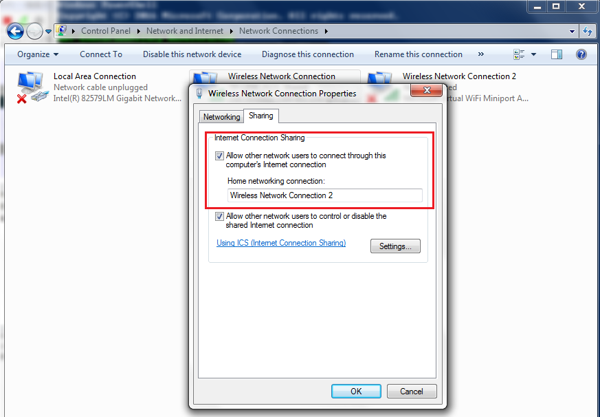

# dig {#dig}

```sh
dig bing.com
```

# netsh {#netsh}

```powershell
# port forward 127.0.0.1:12345 to http://www.nghttp2.org
netsh interface portproxy add v4tov4 listenport=12345 connectaddress=139.162.123.134 connectport=80

# show all
netsh interface portproxy show all

# delete all
netsh interface portproxy reset

# delete one
netsh interface portproxy delete v4tov4 listenport=12345

# help
netsh interface portproxy help
```

# net-tools {#net-tools}

```sh
apt install -y net-tools
```

## netstat {#netstat}

| short option | full option                                                                 |
| ------------ | --------------------------------------------------------------------------- |
| -h           | --help                                                                      |
| -V           | --version                                                                   |
| -n           | --numeric <br/> --numeric-hosts <br/> --numeric-ports <br/> --numeric-users |
| -t           | --tcp                                                                       |
| -u           | --udp                                                                       |
| -x           | --unix                                                                      |

状态统计
```sh
netstat -n | awk '/^tcp/ {++S[$NF]} END {for(a in S) print a, S[a]}'
```

TIME_WAIT状态统计
```sh
netstat -n | awk '/TIME_WAIT/ {++S[$4]} END {for(a in S) print a, S[a]}' | sort -r -n -k2 -t' '
```

# nslookup {#nslookup}

```sh
nslookup bing.com
```


# iproute2 {#iproute2}

```sh
apt install -y iproute2
```

## ss

| short option | full option |
| ------------ | ----------- |
| -h           | --help      |
| -V           | --version   |
| -a           | --all       |
| -n           | --numeric   |
| -t           | --tcp       |
| -u           | --udp       |
| -x           | --unix      |
| -4           | --ipv4      |
| -6           | --ipv6      |
| -H           | --no-header |

```sh
ss -tan | awk 'NR>1 {++S[$1]} END {for (a in S) print a,S[a]}'
```

# tcpdump {#tcpdump}

```sh
apt install -y tcpdump
```

| option                             | description                                                                              |
| ---------------------------------- | ---------------------------------------------------------------------------------------- |
| -h, --help                         | show help                                                                                |
| --version                          | show version                                                                             |
| -A                                 | Print each packet (minus its link level header) in ASCII. Handy for capturing web pages. |
| -c                                 | Exit after receiving count packets.                                                      |
| -s,--snapshot-length               | Snarf snaplen bytes of data from each packet                                             |
| -S,--absolute-tcp-sequence-numbers | Print absolute, rather than relative, TCP sequence numbers.                              |


```sh
# 抓包到文件
tcpdump port 80 -w http-80.pcap

# 解析80端口的100个包
tcpdump port 80 -A -c 100
```

参考 : https://www.tcpdump.org/manpages/tcpdump.1.html


# wireshark {#wireshark} 

## preferences {#wireshark-preferences}

```sh
gui.column.format: 
	"#", "%m",
	"tcp.stream", "%Cus:tcp.stream:0:R",
	"time", "%t",
	"datetime", "%Yut",
	"s.mac", "%uhs",
	"s.ip", "%us",
	"s.port", "%uS",
	"protocol", "%p",
	"d.mac", "%uhd",
	"d.ip", "%ud",
	"d.port", "%uD",
	"length", "%L",
	"info", "%i"
```

# 手机抓包 {#capture-phone-traffic}

1. 设置共享的WLAN
    ```ps1
    # 设置共享的WLAN
    netsh wlan set hostednetwork mode=allow ssid=ssid1 key=12345678

    # 启动共享的WLAN
    netsh wlan start hostednetwork

    # 停止共享的WLAN
    netsh wlan stop hostednetwork
    ```
2. 共享联网的网卡给上述的WLAN的网卡
    

然后通过wireshark抓被共享的网卡即可。
