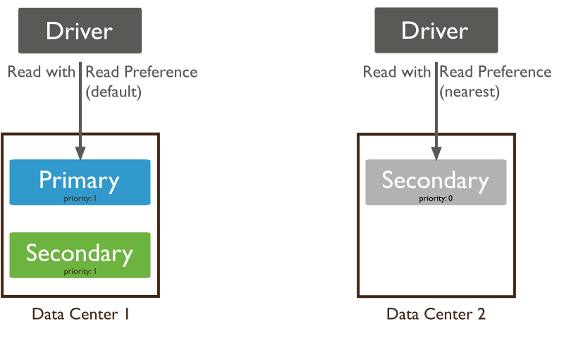

# 1 Connection String {#connection-string}

```http
mongodb://mongodb-server-1:27017,mongodb-server-2:27017/admin
?replicaSet=test-replica-set
&ssl=false
&w=3
&j=true
&wtimeoutMS=5000
&readPreference=secondaryPreferred
&readConcernLevel=local
```


# 2 Read Write Config  {#read-write-config}

## 2.1 Write Concern {#write-concern}

**写操作配置，作用于`MongoDB Server`, 用于指示`MongoDB Server`写入多少个成员后才会返回给`MongoDB Client`**。可用的选项如下:

| 选项                                                                 | 描述说明                                                                                                                   |
| :------------------------------------------------------------------- | :------------------------------------------------------------------------------------------------------------------------- |
| [number][write-concern-number]                                       | 指定固定的成员数（注意必须是数字，不让会被当做tag）。当成员数不够时，`MongoDB Server`会返回`CannotSatisfyWriteConcern`错误 |
| [majority][write-concern-majority]                                   | 写入大多数成员，`MongoDB Server`自动决定写入的成员数数量                                                                   |
| [custom-write-concern-name][write-concern-custom-write-concern-name] | 写入到具有指定tag的成员中                                                                                                  |

成员数不够指定的`w`的数量时的错误信息:
```json
{
  "code": 100,
  "codeName": "CannotSatisfyWriteConcern",
  "errmsg": "Not enough data-bearing nodes"
}
```

比如上面的`w=3`表示至少写入到3个成员才返回到`MongoDB Client`中，通常需搭配`wtimeoutMS`一起使用。当然也可以设置为`w=majority`, 让mongodb自动决定。

```js
db.test_collection.insert(
   { name: "abc"},
   { writeConcern: { w: "majority" , wtimeout: 5000 } }
)
```


## 2.2 Read Preference {#read-preference}

**读操作配置，作用于`MongoDB Client`, 指示`MongoDB Client`使用哪些成员进行读取操作**。可用的选项如下:

| 选项                                                     | 描述说明                                                    |
| :------------------------------------------------------- | :---------------------------------------------------------- |
| [primary][read-preference-primary]                       | 默认值。使用primary成员进行所有的读取操作。                 |
| [primaryPreferred][read-preference-primaryPreferred]     | primary成员优先，当primary成员不可用时，读secondary成员。   |
| [secondary][read-preference-secondaryPreferred]          | 使用secondary成员进行所有的读取操作。                       |
| [secondaryPreferred][read-preference-secondaryPreferred] | secondary成员优先，当secondary成员不可用时，读primary成员。 |
| [nearest][read-preference-nearest]                       | `MongoDB Client`根据网络延迟来决定使用哪个成员。              |



## 2.3 Read Concern Level {#read-concern-level}

**读操作配置，作用于`MongoDB Server`, 用于指示`MongoDB Server`返回满足指定的约束的数据**。可用的选项如下:

| 级别                                      | 描述说明 |
| :---------------------------------------- | :------- |
| [local][read-concern-local]               |          |
| [available][read-concern-available]       |          |
| [majority][read-concern-majority]         |          |
| [linearizable][read-concern-linearizable] |          |
| [snapshot][read-concern-snapshot]         |          |

举例说明（简化假设如下）：
1. `Write0`之前的所有写操作已成功复制到所有成员。
2. Writeprev是`Write0`之前的前一个写。
3. `Write0`之后没有发生其他写操作。

时间线图例。


| 时间 | 事件                                                            | 最新的写                                                              | 最新的`w: "majority"`写？                                                |
| :--- | :-------------------------------------------------------------- | :-------------------------------------------------------------------- | :--------------------------------------------------------------------- |
| t0   | Primary applies `Write0`                                        | Primary: `Write0` <br>Secondary1: Writeprev <br>Secondary2: Writeprev | Primary: Writeprev <br>Secondary1: Writeprev <br>Secondary2: Writeprev |
| t1   | Secondary1 applies `Write0`                                     | Primary: `Write0` <br>Secondary1: `Write0` <br>Secondary2: Writeprev  | Primary: Writeprev <br>Secondary1: Writeprev <br>Secondary2: Writeprev |
| t2   | Secondary2 applies `Write0`                                     | Primary: `Write0` <br>Secondary1: `Write0` <br>Secondary2: `Write0`   | Primary: Writeprev <br>Secondary1: Writeprev <br>Secondary2: Writeprev |
| t3   | Primary得知Secondary1的同步成功，返回到`MongoDB Client`。       | Primary: `Write0` <br>Secondary1: `Write0` <br>Secondary2: `Write0`   | Primary: `Write0` <br>Secondary1: Writeprev <br>Secondary2: Writeprev  |
| t4   | Primary得知Secondary2的同步成功。                               | Primary: `Write0` <br>Secondary1: `Write0` <br>Secondary2: `Write0`   | Primary: `Write0` <br>Secondary1: Writeprev <br>Secondary2: Writeprev  |
| t5   | Secondary1得知`Write0`已满足`readConcernLevel=majority`的要求。 | Primary: `Write0` <br>Secondary1: `Write0` <br>Secondary2: `Write0`   | Primary: `Write0` <br>Secondary1: `Write0` <br>Secondary2: Writeprev   |
| t6   | Secondary2得知`Write0`已满足`readConcernLevel=majority`的要求。 | Primary: `Write0` <br>Secondary1: `Write0` <br>Secondary2: `Write0`   | Primary: `Write0` <br>Secondary1: `Write0` <br>Secondary2: `Write0`    |

### 2.3.1 local {#read-concern-level-local}

| local读取  | 时间 | 数据      |
| :--------- | :--- | :-------- |
| Primary    | t0后 | `Write0`  |
| Secondary1 | t1前 | Writeprev |
| Secondary1 | t1后 | `Write0`  |
| Secondary2 | t2前 | Writeprev |
| Secondary2 | t2后 | `Write0`  |

### 2.3.2 available {#read-concern-level-available}

| available读取 | 时间 | 数据      |
| :------------ | :--- | :-------- |
| Primary       | t0后 | `Write0`  |
| Secondary1    | t1前 | Writeprev |
| Secondary1    | t1后 | `Write0`  |
| Secondary2    | t2前 | Writeprev |
| Secondary2    | t2后 | `Write0`  |

### 2.3.3 majority {#read-concern-level-majority}

| majority读取 | 时间 | 数据      |
| :----------- | :--- | :-------- |
| Primary      | t3前 | Writeprev |
| Primary      | t3后 | `Write0`  |
| Secondary1   | t5前 | Writeprev |
| Secondary1   | t5后 | `Write0`  |
| Secondary2   | t6前 | Writeprev |
| Secondary2   | t6后 | `Write0`  |

# 2 Reference {#reference}

1. https://docs.mongodb.com/manual/reference/glossary/
2. https://docs.mongodb.com/manual/reference/command/nav-crud/
3. https://docs.mongodb.com/manual/reference/connection-string/
4. https://docs.mongodb.com/manual/reference/write-concern/
5. https://docs.mongodb.com/manual/reference/read-concern/
7. https://docs.mongodb.com/manual/reference/method/js-replication/


## 2.2 Replica Set {#reference-replica-set}

1. https://docs.mongodb.com/manual/replication/
2. https://docs.mongodb.com/manual/core/replica-set-hidden-member/
3. https://docs.mongodb.com/manual/core/replica-set-sync/
4. https://docs.mongodb.com/manual/core/replica-set-oplog/
5. https://docs.mongodb.com/manual/applications/replication/
6. https://docs.mongodb.com/manual/core/replica-set-write-concern/
7. https://docs.mongodb.com/manual/core/read-preference/
8. https://docs.mongodb.com/manual/reference/read-concern-majority/


[write-concern-number]:<https://docs.mongodb.com/manual/reference/write-concern/#writeconcern.%3Cnumber%3E>
[write-concern-majority]:<https://docs.mongodb.com/manual/reference/write-concern/#writeconcern._dq_majority_dq_>
[write-concern-custom-write-concern-name]:<https://docs.mongodb.com/manual/reference/write-concern/#writeconcern.%3Ccustom-write-concern-name%3E>

[read-preference-primary]:<https://docs.mongodb.com/manual/core/read-preference/#primary>
[read-preference-primaryPreferred]:<https://docs.mongodb.com/manual/core/read-preference/#primaryPreferred>
[read-preference-secondary]:<https://docs.mongodb.com/manual/core/read-preference/#secondary>
[read-preference-secondaryPreferred]:<https://docs.mongodb.com/manual/core/read-preference/#secondaryPreferred>
[read-preference-nearest]:<https://docs.mongodb.com/manual/core/read-preference/#nearest>

[read-concern-local]:<https://docs.mongodb.com/manual/reference/read-concern-local/>
[read-concern-available]:<https://docs.mongodb.com/manual/reference/read-concern-available/>
[read-concern-majority]:<https://docs.mongodb.com/manual/reference/read-concern-majority/>
[read-concern-linearizable]:<https://docs.mongodb.com/manual/reference/read-concern-linearizable/>
[read-concern-snapshot]:<https://docs.mongodb.com/manual/reference/read-concern-snapshot/>

